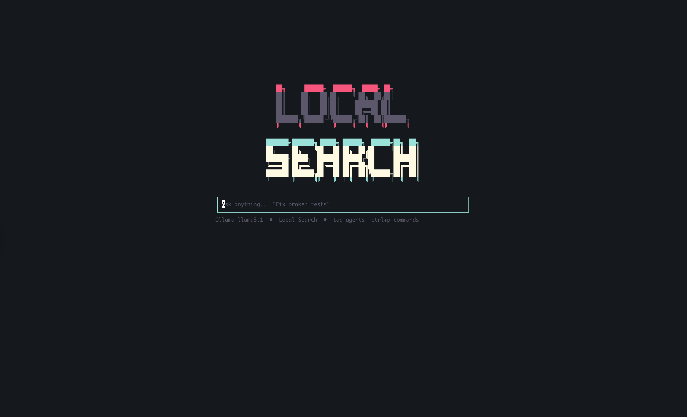

# Donut

A terminal CLI search application for local notes, files, and emails with state-of-the-art RAG (Retrieval-Augmented Generation) capabilities.



## Overview

**Donut** combines **hybrid search** (BM25 + vector embeddings), **cross-encoder reranking**, and **local LLM integration** to provide intelligent search over your personal data—all running entirely offline on your machine.

Config and the SQLite index live under `~/.donut/`. If you are upgrading from an older install, see [Migrating](#migrating).

**Key capabilities:**

- 📄 Search across notes, documents, emails, and images
- 🔍 Hybrid search: keyword (BM25) + semantic (vector)
- 🖼️ Image search with local vision models
- 🤖 Ask questions with local LLM (Ollama)
- 🔒 100% offline, no API keys required

## Quick Start

Run `bun run build` and use the `donut` binary from `dist/`, or invoke the CLI with Bun as shown below. Packaged installs expose the command as **`donut`**.

```bash
# Initialize the database
bun run src/index.ts init

# Add a collection (files, emails, images, or Apple Notes)
bun run src/index.ts add ~/Documents/Notes --name notes

# Add an image collection (requires Ollama vision model)
bun run src/index.ts add ~/Pictures --name photos --type image

# Build the index (downloads models on first run ~50MB)
bun run src/index.ts index

# Search
bun run src/index.ts query "machine learning"

# Ask questions about your documents
bun run src/index.ts ask "what are the main topics?"

# Interactive mode
bun run src/index.ts interactive
```

## Migrating

Earlier versions used **Local Search** / `search-cli` with data in `~/.search-cli/`. To keep your existing config and database:

```bash
mv ~/.search-cli ~/.donut
```

Then run `donut` (or `bun run src/index.ts …`) instead of `search-cli`.

## Search Architecture

```
Query → Hybrid Retrieval → Fusion → Reranking → Results

┌─────────────────┐    ┌─────────────────┐
│   BM25 Search   │    │  Vector Search  │
│   (keywords)    │    │   (semantic)    │
└────────┬────────┘    └────────┬────────┘
         │                      │
         └──────────┬───────────┘
                    ▼
         ┌─────────────────────┐
         │  Score Normalization │
         └──────────┬──────────┘
                    ▼
         ┌─────────────────────┐
         │  Reciprocal Rank    │
         │      Fusion         │
         └──────────┬──────────┘
                    ▼
         ┌─────────────────────┐
         │  Cross-Encoder      │
         │    Reranking        │
         └──────────┬──────────┘
                    ▼
               Results
```

**Why this works:**

1. **BM25** catches exact keyword matches (e.g., "React hooks")
2. **Vector search** finds semantically similar content (e.g., "component lifecycle" matches state management)
3. **RRF fusion** combines both fairly
4. **Reranking** re-scores top results for maximum relevance

## Features

### Data Sources

| Source | Format | Notes |
|--------|--------|-------|
| Files | Markdown, TXT, HTML | Recursive directory scanning |
| Email | Maildir, mbox, .eml | Extracts headers (From, To, Subject, Date) |
| Apple Notes | Notes.app database | macOS only, requires Full Disk Access |
| Images | PNG, JPEG, GIF, WebP | Vision model generates searchable descriptions |

### Image Search

Index and search images using a local vision model. The indexer generates rich descriptions for semantic search:

```bash
# Add an image collection
bun run src/index.ts add ~/Pictures --name photos --type image

# Use a specific vision model
bun run src/index.ts add ~/Screenshots --name screenshots --type image \
  --vision-model llama3.2-vision:11b
```

**Smart prompts for different image types:**

- **Screenshots**: Captures UI elements, app names, visible text, user actions
- **Documents**: Transcribes text, identifies document type (receipt, invoice, letter)
- **Photos**: Describes subjects, setting, mood, activities

**Prerequisites:**
- [Ollama](https://github.com/ollama/ollama) installed
- Vision model pulled: `ollama pull llama3.2-vision`

### Search Features

- **Hybrid Search**: Combine keyword precision with semantic understanding
- **MMR (Maximal Marginal Relevance)**: Diverse results, avoid redundant matches
- **Query Expansion**: Automatic synonym expansion for broader recall
- **Parent Document Retrieval**: Get matched chunks with full document context
- **Metadata Filtering**: Filter by date, collection, file type

### RAG Pipeline

Ask questions about your indexed documents using a local LLM:

```bash
# Prerequisites: Install Ollama and pull a model
ollama pull llama3.1

# Ask a question
bun run src/index.ts ask "what is this project about?"
```

## Commands

| Command | Description |
|---------|-------------|
| `init` | Initialize database and config |
| `add <path>` | Add a collection |
| `remove <name>` | Remove a collection |
| `list` | List all collections |
| `search <query>` | BM25 keyword search |
| `vsearch <query>` | Vector semantic search |
| `query <query>` | Hybrid search (BM25 + Vector) |
| `index` | Build/rebuild search index |
| `status` | Show index statistics |
| `interactive` | Interactive search mode |
| `watch` | Watch for file changes |
| `export <query>` | Export results (JSON/CSV/Markdown) |
| `ask <question>` | Q&A over your documents |

### Query Options

```bash
# Basic search
bun run src/index.ts query "machine learning"

# With options
bun run src/index.ts query "machine learning" \
  --limit 10 \
  --mmr \
  --expand \
  --full

# Filter by collection
bun run src/index.ts query "machine learning" \
  --filter '{"field":"collection","operator":"eq","value":"notes"}'
```

**Options:**

| Flag | Description |
|------|-------------|
| `--limit N` | Max results (default: 10) |
| `--rerank` | Enable cross-encoder reranking (default: true) |
| `--mmr` | Enable diversity-aware selection |
| `--expand` | Enable query expansion with synonyms |
| `--full` | Include full document content |
| `--filter JSON` | Metadata filters |

## Interactive Mode

Launch an interactive terminal UI for conversational search:

```bash
bun run src/index.ts interactive
```

## Programmatic Usage

```typescript
import { RAGPipeline } from './search/pipeline.js';

const pipeline = new RAGPipeline(db, {
  enableReranking: true,
  enableMMR: true,
});

const results = await pipeline.search("machine learning", {
  limit: 10,
  includeFullDocument: true,
});
```

## Apple Notes Setup (macOS)

Apple Notes requires Full Disk Access:

1. Open **System Settings → Privacy & Security → Full Disk Access**
2. Add your Terminal app (Terminal.app, iTerm.app, or IDE)
3. Restart your terminal

```bash
# Add Apple Notes
bun run src/index.ts add apple-notes --name apple-notes --type apple-notes
```

**Troubleshooting:**

If you see "database not found", try specifying the path:

```bash
# macOS Sonoma+
bun run src/index.ts add apple-notes --name apple-notes --type apple-notes \
  --notes-db ~/Library/Containers/com.apple.Notes/Data/Library/Notes/NotesV7.storedata

# Older macOS
bun run src/index.ts add apple-notes --name apple-notes --type apple-notes \
  --notes-db ~/Library/Containers/com.apple.Notes/Data/Library/Notes/Notes.db
```

## Tech Stack

- **Runtime**: Bun
- **Database**: SQLite with sqlite-vec extension
- **Embeddings**: Xenova Transformers (MiniLM-L6-v2)
- **Reranking**: Cross-encoder (MSMARCO)
- **LLM**: Ollama (llama3.1 or any model)

## License

MIT